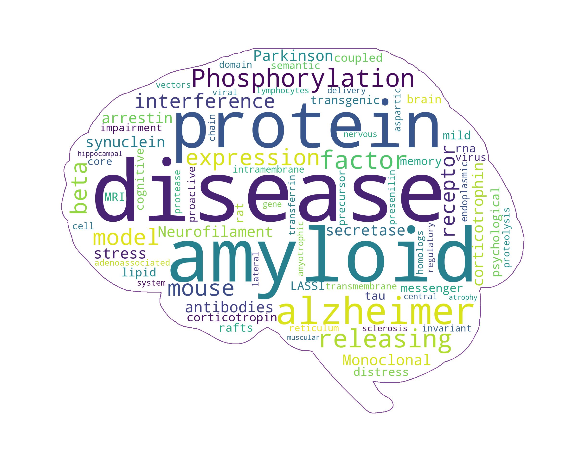

# ADRC Publication Wordcloud

This script generates a wordcloud off of a text file of keywords.

## Running

1. Copy the keywords into a textfile named `keywords.txt`. (You can place them on each line or seperated by semicolons)
1. Run the script using the following command

```bash
$ python3 pubwordcloud.py
```

1. The image will be named `wordcloud.png`

## Example

This is an example of the wordcloud that was created with the keywords.txt in this repo.



## TODO

* Add options to take in a list of PubMed IDs
* Add command flags to change between text file and list of PubMed IDs

## More information

* [Wordcloud library](https://github.com/amueller/word_cloud)
